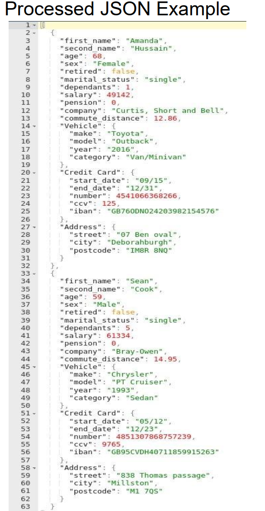

# Computer Data Pre-Processing

THe numbers of records provided is significant, and therefore it is expected that the solutions are robust to varying types of data, and varying values, offering a programmatic solution.

## Data Processing (70%)

- [X] Step 1

  - [X] Read in the provided ACS Data using the CSV library.

- [X] Step 2

  - [X] Convert all flat structures into nested structures. These are notably:
    - [X] Vehicle:
      - [X] make,
      - [X] model,
      - [X] year, and
      - [X] type
    - [X] Credit Card:
      - [X] start date,
      - [X] end date,
      - [X] number,
      - [X] security code, and
      - [X] IBAN
    - [X] Address:
      - [X] main address,
      - [X] city,
      - [X] postcode
  - [X] Ensure values read in are appropriately cast to their respective types.

- [X] Step 3

  - [X] Print a list where all corrections are made to allow proper data type conversion. (e.g., Problematic rows for dependants: [16, 58, 80, 98])

- [X] Step 4

  - [X] Write all records to a *processed.json* file in the JSON data format. It should be a list of dictionaries, where each index of the list is a dictionary representing a single person.

- [ ] Step 5

  - [ ] Create 2 additional file outputs:
    - [ ] *retired.json*, and
    - [ ] *employed.json*

- [ ] Step 6

  - [ ] Create a function that accepts a single row from the CSV data, and outputs whether the row should be flagged.
  - [ ] Row should be flagged for any customers that have more than 10 years between their credit card start and end date.
  - [ ] Function should then be used to determine whether add the (input row) customer to the to a separate file called *remove_ccard.json*.

- [ ] Step 7 - Reading from the *processed.json* file

  - [ ]  Create a new data attribute for the customers called "Salary-Commute" representing the Salary a customer earns per mile of their commute. (If they travel <= 1 miles, their salary-commute would just be their salary.)
  - [ ] Add and calculate this new attribute for each customer.
  - [ ] Sort the records by Salary-Commute in ascending order
  - [ ] Store the output in *commute.json* file.

## Data Visualization (20%)

Using Pandas and Seaborn.

- [ ] Step 1

  - [ ] Obtain the Data Series for Salary and Age and calculate:
    - [ ] Mean Salary
    - [ ] Median Age

- [ ] Step 2 - Perform univariate plots of the following data attributes:

  - [ ] Age, calculating how many bins would be required for a bin_width of 5,
  - [ ] Dependents, fixing data errors with seaborn itself
  - [ ] Age (of default bins), conditioned on Marital Status

- [ ] Step 3 - Perform multivariate plots with the following data attributes:

  - [ ] Commuted distance against salary
  - [ ] Age against Salary
  - [ ] Age against Salary conditioned by Dependents

- [ ] Step 4 - Provide a Notebook cell that provides the client with the ability to save the plots produced above.

## Code Presentation (10%)

The code you produce to solve the above tasks should make good use of structure, logic, and commenting to be clear and robust. Variable names should be thoughtfully considered, and appropriate for purpose. Ensure that scope conflicts are avoided, and that variable names don't leak into other areas of code. You should consider how the structures covered throughout the module may be used. Similarly, you should be mindful of error handling
where appropriate.

Use of Markdown Cells is advised to keep clear distinction between Tasks. When writing your algorithms for solving the above, it may be useful to keep in mind reusability of code,
reducing the amount of boilerplate code, and duplicated code.

## Deliverables

Submission is to be a complete ipynb notebook, alongside any file outputs your program generates (E.g S, retired.json, employed.json, remove_ccard.json, commute.json, including any seaborn figures saved).

The Notebook should contain all output cells (ie. Showing the program output from when you executed the code to generate the attached files mentioned above).

